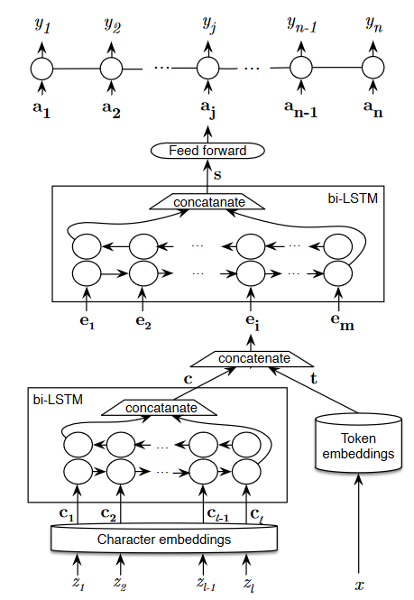

SkimLit: Let's make [PubMed](https://pubmed.ncbi.nlm.nih.gov/) abstracts easier to read 

Pubmed is a platform where we can find millions of articles in medical fields

THe purpose of this project is to build an NLP model to make reading medical abtracts easier.

Model: Replicate the [PubMed 200k RCT: a Dataset for Sequential Sentence Classification in Medical Abstracts](https://arxiv.org/abs/1710.06071) paper

(model structure avalaible here https://arxiv.org/pdf/1612.05251.pdf)

``This is a multimodal model, and its implementation is carried out using TensorFlow-Keras.``

Input and output:

